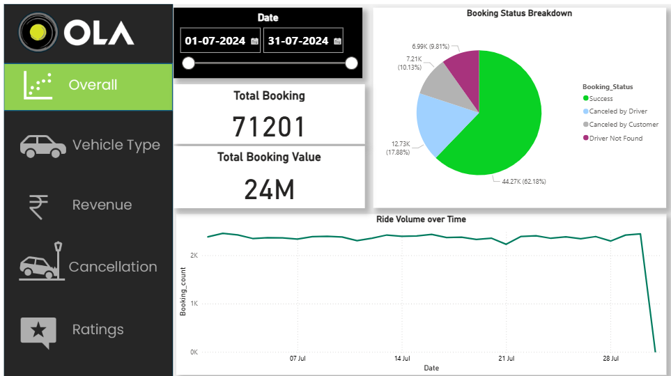
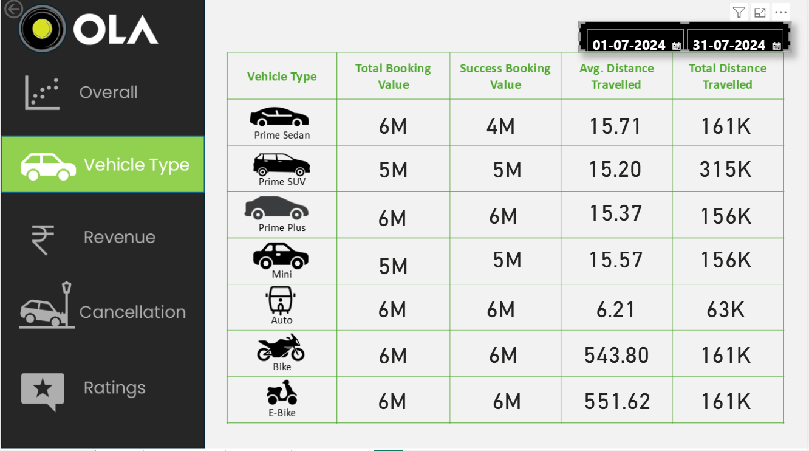
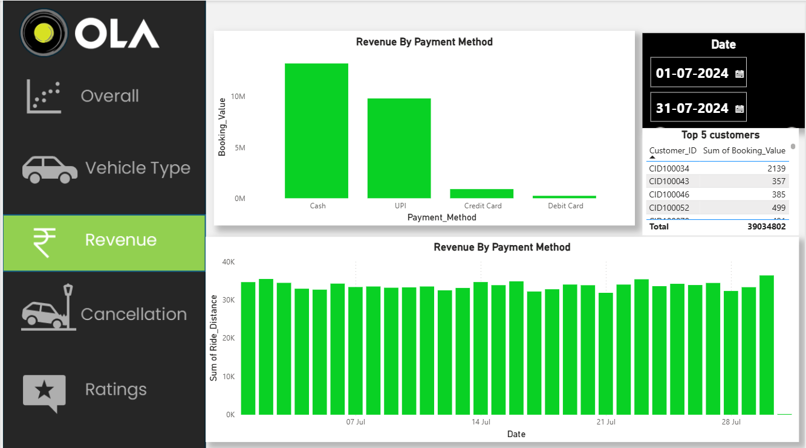

# 🚖 Ola Booking Dashboard Analysis

## 📌 Project Overview
This project focuses on analyzing ride booking data similar to Ola. The main objective is to understand booking patterns, customer behavior, cancellations, and revenue trends using an interactive dashboard.

The dashboard provides clear insights into different aspects of ride bookings, helping in better decision-making.

---

## 📊 Dataset Description
The dataset includes the following key fields:

- Date & Time of Booking  
- Booking ID & Status  
- Customer ID  
- Vehicle Type  
- Pickup & Drop Location  
- Ride Distance  
- Booking Value (Revenue)  
- Payment Method  
- Cancellation Details (Customer & Driver)  
- Incomplete Rides & Reasons  
- Driver Ratings & Customer Ratings  

---

## 📈 Dashboard Insights

### 🚗 1. Vehicle Type Analysis
- Number of bookings per vehicle type  
- Most preferred vehicle category  
- Revenue generated by each vehicle type  

---

### ❌ 2. Cancellation Analysis
- Total cancelled rides  
- Cancellations by customers vs drivers  
- Common reasons for ride cancellations  
- Impact of cancellations on overall business  

---

### 💰 3. Revenue Analysis
- Total revenue generated  
- Revenue trends over time  
- Revenue by vehicle type  
- High-value bookings insights  

---

### ⭐ 4. Ratings Analysis
- Average driver ratings  
- Average customer ratings  
- Relationship between ratings and ride completion  
- Customer satisfaction insights  

---

### 📍 5. Ride & Location Insights
- Popular pickup and drop locations  
- Ride distance distribution  
- Time-based booking trends  

---

## 🛠️ Tools & Technologies Used
- Power BI / Excel / SQL (update based on your tool)  
- Data Cleaning & Data Transformation  
- Data Visualization  

---

## 🎯 Project Objective
The main goal of this project is to:
- Analyze ride booking data  
- Identify trends and patterns  
- Understand customer and driver behavior  
- Provide insights to improve business performance  

---

## 📷 Dashboard Preview

## Vehicle_Type

## Revenue

---

## 🚀 Key Learnings
- Data cleaning and preprocessing  
- Creating interactive dashboards  
- Extracting business insights from raw data  
- Understanding real-world data patterns  

---

## 📌 Conclusion
This project demonstrates how data can be used to analyze ride booking systems like Ola. The insights generated can help in improving customer experience, reducing cancellations, and increasing revenue.

---

## 🔗 Connect With Me
- LinkedIn: https://www.linkedin.com/in/sakshi7452  
- GitHub: https://github.com/satakshirawat25  
